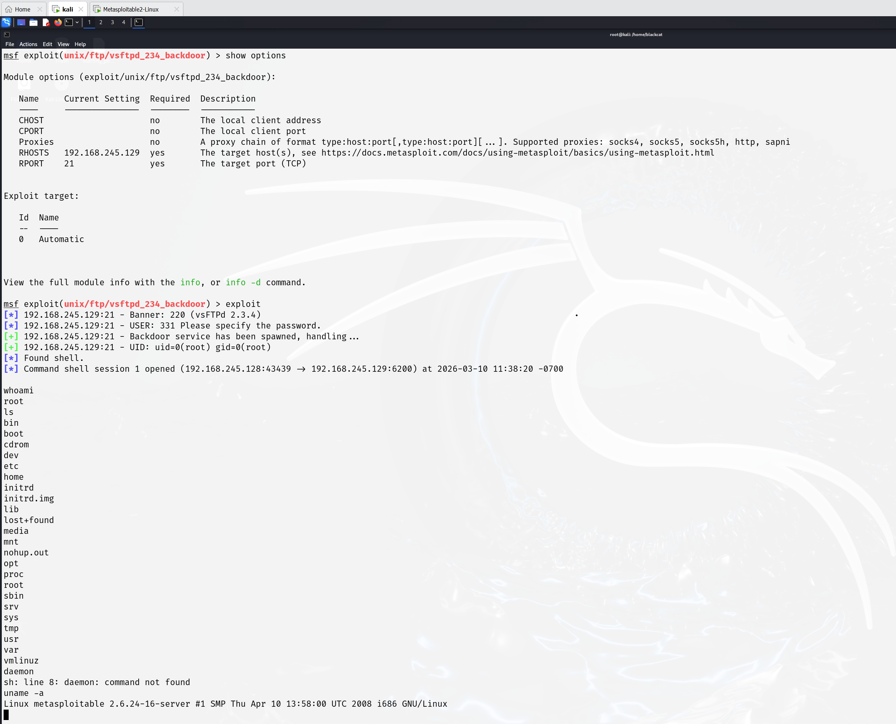
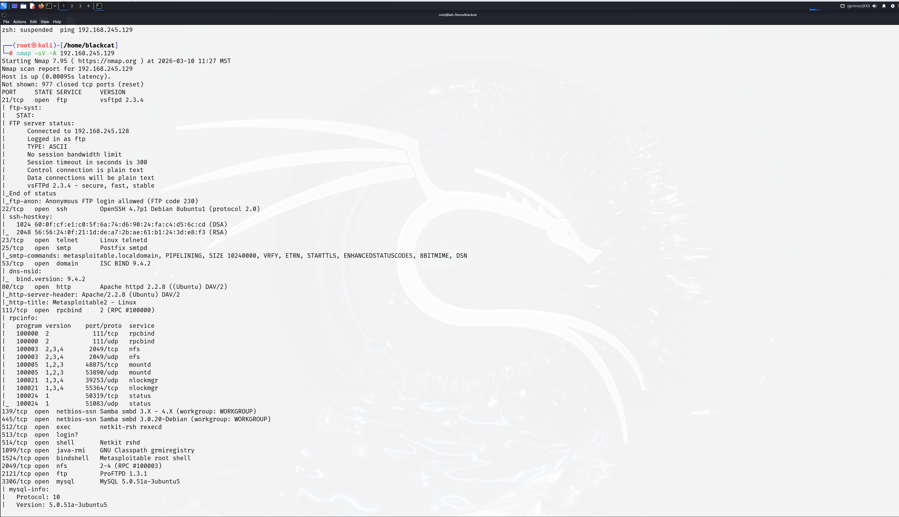
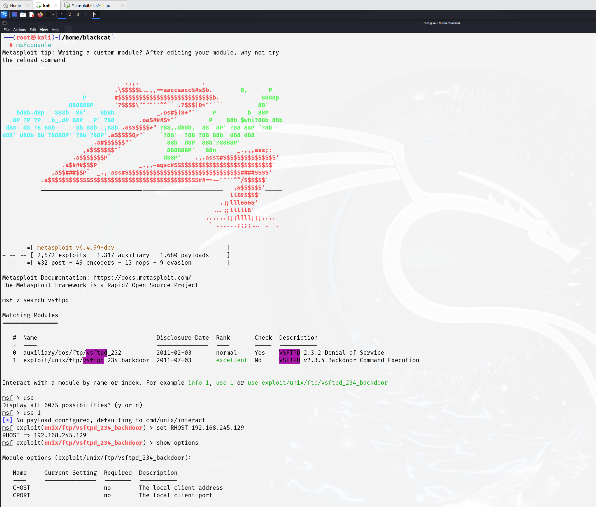
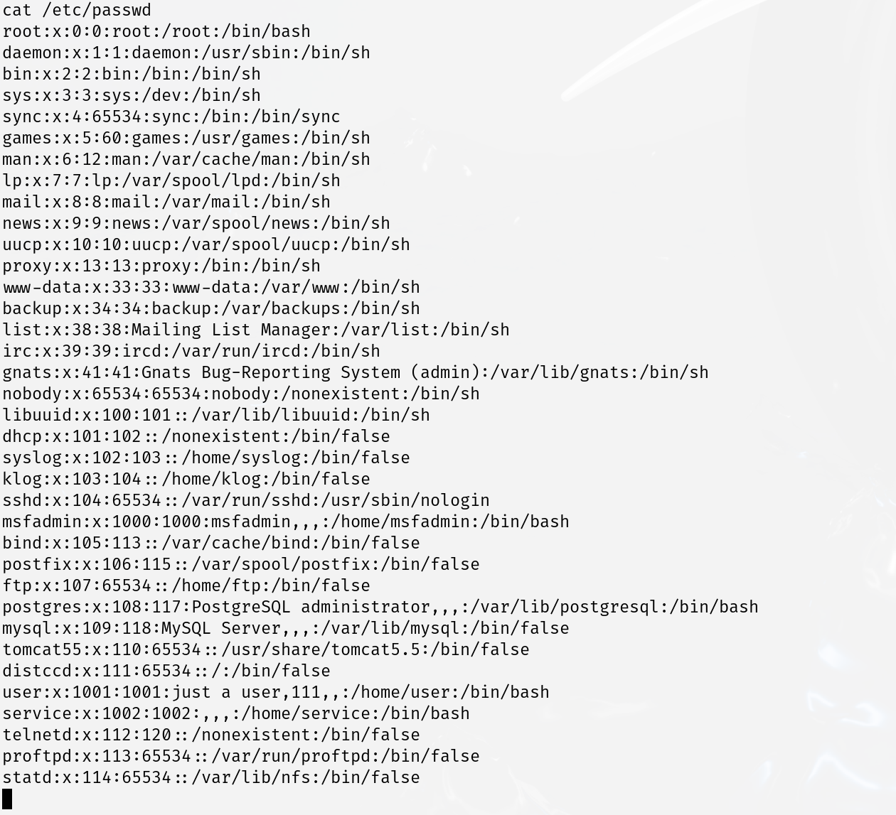

# metasploitable-lab
Cybersecurity lab exploring Metasploitable 2 environment and system structure
## Lab Environment

Attacker Machine

- Kali Linux

Target Machine
- Metasploitable 2

## Logging into the Target Machine

Username: msfadmin
Password: msfadmin
### Metasploitable Target Machine

### Nmap Scan Results

## Checking Current User

Command used:

whoami

Output:
root
### Metasploit Exploit

## Exploring File System

Command:

ls /

## Checking Root Directory

Command:

ls /root
### Viewing Users

